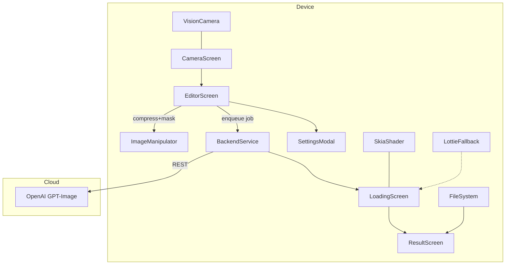

System Architecture
1. Component diagram


2. BackendService responsibilities
```txt
prepareImage()
  ├─ rotate / resize / compress to PNG/JPEG ≤ 4 MB
prepareMask()
  ├─ ensure alpha channel matches image dims
buildPrompt()
  ├─ presets[styleId].template or custom text
callOpenAI()
  ├─ images.generate | images.edit
  └─ input_fidelity = 'high' if enabled
```

3. Data model snippets
```ts
type StylePreset = {
  id: string;          // 'kodachrome-64'
  name: string;        // 'Kodachrome ’64'
  prompt: string;      // GPT prompt template
  thumbnailLutUri: string;
};

type GenerationJob = {
  id: string;
  type: 'generate' | 'edit';
  presetId: string | null;   // null = custom
  inputFidelity: boolean;
  params: {
    quality: 'low' | 'medium' | 'high' | 'auto';
    size: 'auto' | '1024x1024' | '1536x1024' | '1024x1536';
    format: 'jpeg' | 'png' | 'webp';
    compression: number;
    background: 'transparent' | 'default';
    n: number;
  };
  status: 'pending' | 'success' | 'error';
  outputs: string[];         // file URIs
};
``` 